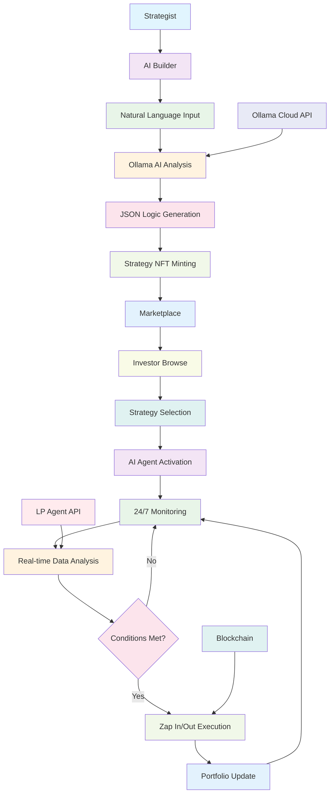
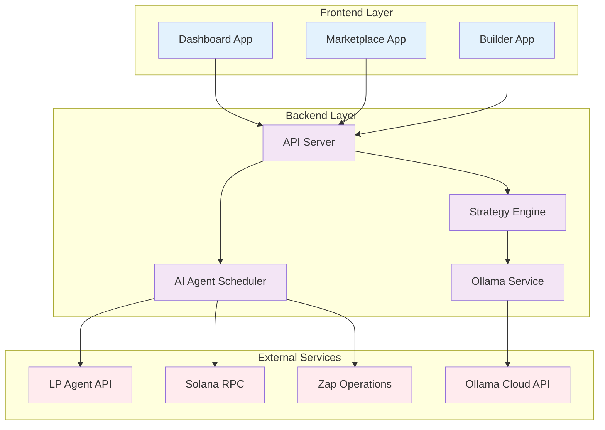

# 🎨 Diagram Display Solutions for GitHub

## 🚨 **Current Issue**
SVG files không hiển thị tốt trên GitHub markdown renderer.

## 💡 **Solutions**

### **Option 1: Use Mermaid Diagrams (Recommended)**
```markdown
## 🔄 System Workflow



## 🏗️ System Architecture


```

### **Option 2: Use PNG Images**
Convert SVG → PNG và upload:
```markdown


```

### **Option 3: Use GitHub Pages**
Host images trên GitHub Pages:
```markdown


```

### **Option 4: Use External Image Hosting**
Upload lên Imgur hoặc dịch vụ khác:
```markdown


```

---

## 🎯 **Recommended Action**

**Sử dụng Option 1 (Mermaid)** vì:
- ✅ GitHub native support
- ✅ No external dependencies
- ✅ Professional appearance
- ✅ Easy maintenance
- ✅ Color-coded components

## 📝 **Implementation Steps**

1. **Replace current SVG references** với mermaid code
2. **Test trên GitHub** để đảm bảo hiển thị
3. **Commit và push** thay đổi
4. **Verify display** trên browser

---

## 🔧 **Quick Fix Commands**

```bash
# Backup current README
cp README.md README-backup.md

# Apply mermaid version
# (Copy mermaid code from Option 1 above)

# Commit changes
git add README.md
git commit -m "Fix diagram display with mermaid"
git push origin master
```
