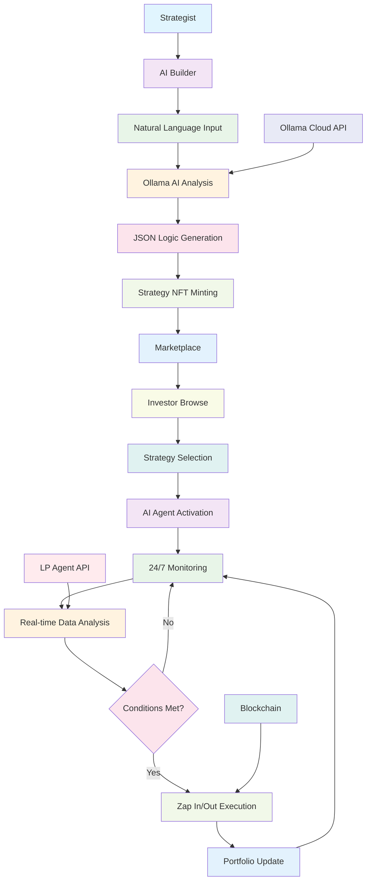
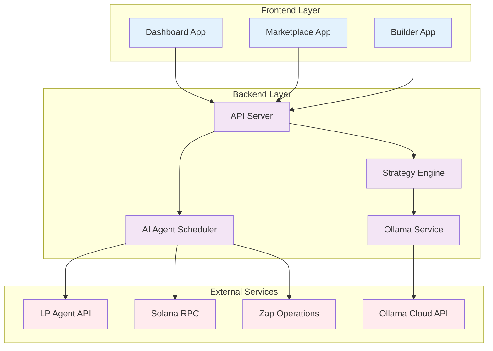

# 🚀 Lumina Market - AI LP Strategist Marketplace

**"Don't just provide liquidity, trade the intelligence."**

Lumina Market is a pioneering platform that enables "Tokenization" of liquidity provision (LP) strategies. Instead of just trading tokens or art NFTs, Lumina Market creates a marketplace where traders (Strategists) can package their trading intelligence into Strategy NFTs, and investors can hire AI Agents to execute these strategies automatically.

---

## 💡 Concept & Problem Solving

**Problem:** Providing liquidity (LP) on DEX exchanges requires deep knowledge of risk management, continuous monitoring of Volume and APY. Most retail users don't have the time or skills to optimize their LP positions.

**Solution:** 
- **For Strategists:** Provide a No-code Builder using AI to convert trading ideas into executable logic without writing code.
- **For Investors:** Provide a transparent marketplace with "Proof of Profit" allowing them to invest in the most effective strategies through AI Agents.

---

## 🔄 System Workflow



### **Workflow Steps:**

1. **Strategy Creation (Strategist):** 
   - Use **AI Builder** → Natural language description → AI (Ollama Gemma3:12B) analyzes and generates JSON Logic → Mint as **Strategy NFT**.

2. **Performance Proof (Proof of Profit):** 
   - System uses historical data from LP Agent API to backtest strategy → Display PnL charts and Max Drawdown.

3. **Investment & Activation (Investor):** 
   - Browse Marketplace → Select strategy → Connect wallet → Activate AI Agent for portfolio execution.

4. **Automated Execution (AI Agent):** 
   - AI Agent runs 24/7 → Monitor Pool data (Volume, APY, Volatility) → When conditions met → Automatically call **Zap in/out API** to allocate capital.

---

## 🏗️ System Architecture



### **Frontend (Next.js 14)**
- **Dashboard:** Real-time AI Agent and strategy monitoring
- **Marketplace:** Browse and invest in Strategy NFTs
- **Builder:** No-code AI-powered strategy creation
- **Tech Stack:** TypeScript, TailwindCSS, Lucide Icons

### **Backend (Node.js/Express)**
- **API Server:** RESTful endpoints for all operations
- **AI Agent Scheduler:** 24/7 monitoring and execution
- **Strategy Engine:** Logic parsing and validation
- **Tech Stack:** TypeScript, Express, CORS, JSON

### **AI Services**
- **Ollama Service (Backend):** Local service handling AI requests and responses
- **Strategy Analysis:** Convert natural language → JSON logic
- **Real-time Processing:** Local AI service with Cloud API integration

### **External APIs**
- **LP Agent API:** Real pool data (APY, TVL, Volume)
- **Ollama Cloud API:** Cloud-based AI model hosting
- **Solana RPC:** Blockchain interactions
- **Zap Operations:** Automated liquidity management

---

## 🛠️ Installation & Setup

### **Prerequisites**
- Node.js 18+
- npm or yarn
- Ollama API key (for AI processing)

### **Backend Setup**
```bash
cd backend
npm install
cp .env.example .env
# Update .env with your API keys
npm run dev
```

### **Frontend Setup**
```bash
cd frontend
npm install
npm run dev
```

### **Environment Variables**
```bash
# Backend (.env)
PORT=4002
OLLAMA_API_KEY=your_ollama_api_key
LP_AGENT_API_KEY=your_lpagent_api_key
LP_AGENT_API_URL=https://api.lpagent.io
MOCK_MODE=false

# Frontend (.env.local)
NEXT_PUBLIC_API_URL=http://localhost:4002/api
```

---

## 📊 API Endpoints

### **Health & Status**
- `GET /api/health` - System health check
- `GET /api/ai-agent/status` - AI Agent status
- `GET /api/ai-agent/monitoring` - Real-time monitoring status

### **Strategies**
- `GET /api/strategies` - List all strategies
- `POST /api/strategies/analyze` - AI strategy analysis
- `POST /api/strategies/create` - Create new strategy
- `GET /api/strategies/:id` - Get strategy details

### **AI Agent Management**
- `POST /api/ai-agent/start` - Start AI Agent
- `POST /api/ai-agent/stop` - Stop AI Agent
- `POST /api/execution/run` - Execute strategy

### **LP Agent Integration**
- `GET /api/lp-agent/pools` - Get pool data
- `GET /api/lp-agent/positions/:owner` - Get LP positions

---

## 🤖 AI Model Configuration

### **Ollama Integration**
- **Model:** Gemma3:12B (Cloud-based)
- **API:** https://ollama.com/api/chat
- **Authentication:** Bearer token
- **Response Format:** JSON object

### **Strategy Analysis**
```javascript
// Input (Natural Language)
"If SOL-USDC volume increases by 25% in 1 hour and APY is above 15%, zap in 75% of capital"

// Output (JSON Logic)
{
  "conditions": [
    {
      "metric": "volume",
      "operator": "increased_by_percent",
      "value": 25,
      "timeframe": "1h"
    },
    {
      "metric": "apy",
      "operator": "greater_than",
      "value": 15,
      "timeframe": "24h"
    }
  ],
  "actions": [
    {
      "type": "zap_in",
      "amount_percent": 75
    }
  ],
  "frequency": "realtime"
}
```

---

## 📱 User Interface

### **Dashboard (/dashboard)**
- Real-time AI Agent status
- Strategy performance metrics
- Portfolio monitoring
- Activity logs

### **Marketplace (/marketplace)**
- Browse available strategies
- Filter by risk level and performance
- Strategy details and backtest results
- One-click investment

### **Builder (/builder)**
- Natural language strategy input
- AI-powered logic generation
- Real-time preview
- Strategy minting

---

## 🔧 Testing & Development

### **System Verification**
```bash
# Verify complete system
node verify-complete-system.js

# Test AI functionality
node test-ollama-ai.js

# Check LP Agent data
node check-lp-agent-api.js
```

### **Test Scripts**
- `verify-complete-system.js` - Full system health check
- `test-ollama-ai.js` - AI model testing
- `check-lp-agent-api.js` - LP Agent API verification

---

## 📈 Performance Metrics

### **System Status**
- **Backend:** Port 4002 - ✅ Running
- **Frontend:** Port 3000 - ✅ Running
- **AI Agent:** 24/7 Monitoring - ✅ Active
- **Ollama AI:** Gemma3:12B - ✅ Working
- **LP Agent API:** Real Data - ✅ Connected

### **Active Strategies**
1. **Solana Stable Growth** (Low risk) - 🟢 Active
2. **Aggressive Volatility Hunter** (High risk) - 🟢 Active
3. **Delta Neutral Guard** (Medium risk) - 🟢 Active

---

## 🚀 Production Deployment

### **Live URLs**
- **🌐 Frontend:** https://lumiamarketlpagent.vercel.app
- **🔧 Backend:** https://lumina-market-backend-production.up.railway.app
- **📱 Demo:** Full production application ready for hackathon

### **API Integration**
- **Request URL:** `https://lumina-market-backend-production.up.railway.app/api/strategies`
- **Health Check:** `https://lumina-market-backend-production.up.railway.app/api/health`
- **LP Agent API:** `https://lumina-market-backend-production.up.railway.app/api/lp-agent/pools`
- **AI Agent Status:** `https://lumina-market-backend-production.up.railway.app/api/ai-agent/status`

### **Production Setup**
1. **Backend:** Railway deployment with Docker
2. **Frontend:** Vercel deployment with custom domain
3. **AI Agent:** Auto-starts with backend
4. **Monitoring:** Real-time health checks

### **Environment Configuration**
- **Development:** Local ports 3000/4002
- **Production:** Domain-based URLs
- **API Keys:** Environment-specific
- **Database:** In-memory (demo) → PostgreSQL (production)

### **API Integration**
- **Frontend → Backend:** https://lumina-market-backend-production.up.railway.app
- **Backend Services:** LP Agent API, Ollama AI, Solana RPC
- **Real-time Data:** 24/7 monitoring and execution

---

## 🤝 Contributing

1. Fork repository
2. Create feature branch
3. Make changes with tests
4. Submit pull request

---

## 📄 License

MIT License - see LICENSE file for details

---

## 🆘 Support & Help

### **Common Issues**
- **Port conflicts:** Ensure ports 3000/4002 are available
- **API keys:** Verify Ollama and LP Agent API keys
- **AI responses:** Check model availability and quotas

### **Debug Commands**
```bash
# Check system status
curl http://localhost:4002/api/health

# Test AI analysis
curl -X POST http://localhost:4002/api/strategies/analyze \
  -H "Content-Type: application/json" \
  -d '{"prompt": "If volume increases 20%, zap in 50%"}'

# Verify AI Agent
curl http://localhost:4002/api/ai-agent/status
```

---

## 🎯 Roadmap

### **Phase 1: Core Features** ✅
- [x] AI-powered strategy builder
- [x] Real-time AI Agent monitoring
- [x] LP Agent API integration
- [x] Strategy marketplace

### **Phase 2: Advanced Features**
- [ ] Multi-chain support
- [ ] Advanced risk management
- [ ] Mobile app
- [ ] Governance token

### **Phase 3: Ecosystem**
- [ ] Third-party integrations
- [ ] Professional strategist tools
- [ ] Institutional features
- [ ] Cross-chain liquidity

---

## 📞 Contact

- **GitHub:** [Repository link]
- **Documentation:** [Docs link]
- **Support:** [Support email]

---

**🎉 Lumina Market - Where Intelligence Meets Liquidity**

*Built with ❤️ using Next.js, Node.js, and Ollama AI*
